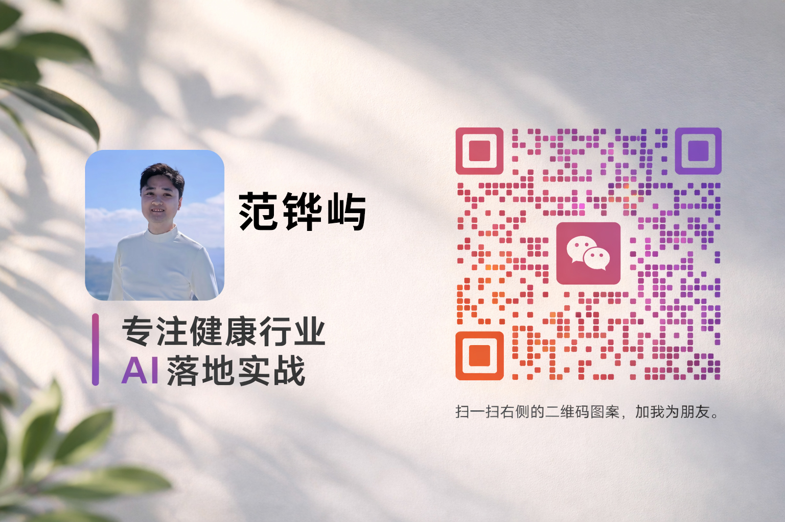

# 健康行业AI落地快速诊断 Skill

## Skill定位

**一句话描述**：帮健康行业企业家快速判断AI是否适合自己、怎么落地、怎么不踩坑

**目标用户**：健康行业企业家、数字化转型负责人

**核心价值**：
- 把"判断力"变成可执行的诊断流程
- 30分钟内完成诊断，输出可落地的建议
- 积累行业案例，反哺公众号内容

---

## 触发场景

### 什么时候使用这个Skill？

**典型触发词**：
- "帮我做个AI诊断"
- "我想看看我们公司适不适合用AI"
- "AI能帮我解决什么问题？"
- "我们企业想做AI落地，从哪开始？"
- "帮我诊断一下我们的AI准备度"
- "健康行业AI落地怎么做？"

**适用场景**：
1. 企业老板第一次接触AI，不知道从哪开始
2. 企业有一定数字化基础，想评估AI落地可行性
3. 企业有明确痛点，想知道AI能不能解决
4. 企业担心AI落地的风险和成本

**不适用场景**：
1. 已经有成熟AI应用的企业（需要高级诊断模式）
2. 非健康行业的企业（诊断框架可参考，但行业适配度低）
3. 纯技术咨询问题（如"怎么部署大模型"）

---

## 诊断框架

### 第一部分：基础信息

```
┌─────────────────────────────────────────────────────┐
│  个人信息                                              │
├─────────────────────────────────────────────────────┤
│  姓名：_______________   性别：□男 □女               │
│  出生年月：_______________                           │
│  联系电话：_______________                           │
│  微信：_______________                               │
│  邮箱：_______________                               │
└─────────────────────────────────────────────────────┘
```

### 第二部分：企业信息

```
┌─────────────────────────────────────────────────────┐
│  企业基础信息                                          │
├─────────────────────────────────────────────────────┤
│  企业名称：_______________（与营业执照一致）          │
│  职位：_______________                               │
│  创立时间：____年____月                              │
│                                                      │
│  所属行业：                                           │
│  □ 医疗机构（医院/诊所/体检/口腔/眼科等）            │
│  □ 大健康零售（药店/保健品/医疗器械/母婴等）         │
│  □ 健康服务（康复/养老/健康管理/减肥/养生等）        │
│  □ 其他：_______________                             │
│                                                      │
│  所属板块（可多选）：                                 │
│  □ 体验营销（线下体验店、体验中心等）                │
│  □ 会议营销（招商会、发布会、培训会等）              │
│  □ 直营连锁（自营门店为主）                          │
│  □ 渠道分销（代理商、经销商为主）                    │
│  □ 生产研发（自有工厂、研发团队）                    │
│  □ 招商代理（招募加盟商、代理商）                    │
│  □ 社群新零售（私域社群、社交电商）                  │
│  □ 线上平台（电商、APP、小程序）                     │
│  □ 其他：_______________                             │
└─────────────────────────────────────────────────────┘
```

### 第三部分：经营数据

```
┌─────────────────────────────────────────────────────┐
│  门店/渠道规模                                        │
├─────────────────────────────────────────────────────┤
│  直营店：____家                                       │
│  加盟店：____家                                       │
│  覆盖省份：____省（包括：____、____、____等）        │
│                                                      │
│  团队规模：                                           │
│  总部：____人                                         │
│  一线门店：____人                                     │
│                                                      │
│  年营业额规模：                                       │
│  □ 500万以下                                         │
│  □ 500万 - 2000万                                    │
│  □ 2000万 - 1亿                                      │
│  □ 1亿以上                                           │
└─────────────────────────────────────────────────────┘
```

```
┌─────────────────────────────────────────────────────┐
│  核心产品/服务体系                                    │
├─────────────────────────────────────────────────────┤
│  核心产品1：_______________                          │
│  适用人群：_______________                           │
│  年销售额占比：约____%                               │
│                                                      │
│  核心产品2：_______________                          │
│  适用人群：_______________                           │
│  年销售额占比：约____%                               │
│                                                      │
│  客户类型占比：                                       │
│  患者用户：约____%                                   │
│  消费者用户：约____%                                 │
│  企业客户：约____%                                   │
└─────────────────────────────────────────────────────┘
```

### 第四部分：数字化现状

```
┌─────────────────────────────────────────────────────┐
│  数字化程度评估（1-5分）                               │
├─────────────────────────────────────────────────────┤
│  内部管理：□1(无系统) □2(基础OA) □3(ERP/CRM)        │
│           □4(数据打通) □5(智能化)                    │
│                                                      │
│  客户管理：□1(无记录) □2(Excel) □3(基础CRM)         │
│           □4(会员系统) □5(精准画像)                  │
│                                                      │
│  营销渠道：□1(线下为主) □2(有公众号) □3(多平台运营)  │
│           □4(私域运营) □5(全渠道数据打通)            │
│                                                      │
│  数据意识：□1(凭感觉) □2(有报表) □3(定期分析)        │
│           □4(数据驱动决策) □5(预测性分析)            │
│                                                      │
│  团队数字化能力：□1(抵触) □2(被动接受) □3(基本会用) │
│                 □4(主动学习) □5(数字化原生)          │
└─────────────────────────────────────────────────────┘
```

### 第五部分：AI机会点识别

```
┌─────────────────────────────────────────────────────┐
│  业务痛点扫描（多选）                                  │
├─────────────────────────────────────────────────────┤
│  客户获取：                                            │
│  □ 获客成本高，渠道效果差                             │
│  □ 不知道客户从哪来                                   │
│  □ 新客转化率低                                       │
│                                                      │
│  客户服务：                                            │
│  □ 客服人力成本高                                     │
│  □ 响应不及时，客户投诉                               │
│  □ 重复问题多，效率低                                 │
│  □ 服务时间受限（非工作时间无人响应）                 │
│                                                      │
│  内容生产：                                            │
│  □ 缺乏内容创作能力                                   │
│  □ 内容产出慢，跟不上热点                             │
│  □ 多平台分发效率低                                   │
│                                                      │
│  运营效率：                                            │
│  □ 流程繁琐，人工处理多                               │
│  □ 数据分散，难以分析                                 │
│  □ 决策靠经验，缺乏数据支撑                           │
│                                                      │
│  合规风险：                                            │
│  □ 不确定AI使用是否合规                               │
│  □ 担心数据安全                                       │
│  □ 行业监管政策不了解                                 │
│                                                      │
│  其他痛点：_______________                            │
└─────────────────────────────────────────────────────┘
```

```
┌─────────────────────────────────────────────────────┐
│  AI机会点匹配（基于痛点自动生成）                       │
├─────────────────────────────────────────────────────┤
│  优先级评估维度：                                      │
│  - 痛点强度（1-5分）                                  │
│  - AI成熟度（1-5分）：技术是否成熟可用                │
│  - 落地难度（1-5分）：实施复杂度                      │
│  - 预期ROI（1-5分）：投入产出比预估                   │
│                                                      │
│  综合得分 = 痛点强度 × AI成熟度 × ROI / 落地难度      │
└─────────────────────────────────────────────────────┘
```

**常见AI应用场景优先级矩阵（健康行业）**：

| 应用场景 | 痛点强度 | AI成熟度 | 落地难度 | 预期ROI | 综合得分 | 推荐度 |
|---------|---------|---------|---------|---------|---------|--------|
| 智能客服 | 5 | 5 | 2 | 4 | 50 | ⭐⭐⭐⭐⭐ |
| 内容生成 | 4 | 4 | 2 | 3 | 24 | ⭐⭐⭐⭐ |
| 私域运营 | 4 | 4 | 3 | 4 | 21 | ⭐⭐⭐⭐ |
| 数据分析 | 3 | 4 | 3 | 4 | 16 | ⭐⭐⭐ |
| AI直播 | 4 | 3 | 4 | 3 | 9 | ⭐⭐⭐ |
| AI诊断辅助 | 5 | 3 | 5 | 4 | 12 | ⭐⭐⭐ |
| 智能排班 | 3 | 3 | 4 | 3 | 7 | ⭐⭐ |

### 第六部分：落地可行性评估

```
┌─────────────────────────────────────────────────────┐
│  资源准备度评估                                        │
├─────────────────────────────────────────────────────┤
│  预算投入意愿：                                        │
│  □ <5万（低成本试水）                                 │
│  □ 5-20万（中等投入）                                │
│  □ 20-100万（较大投入）                              │
│  □ >100万（战略级投入）                              │
│  □ 不确定，需要评估                                   │
│                                                      │
│  技术能力：                                            │
│  □ 无技术团队，需要外部支持                           │
│  □ 有基础运维，能配合实施                             │
│  □ 有开发团队，可自主开发                             │
│                                                      │
│  数据基础：                                            │
│  □ 数据分散，需要清洗整理                             │
│  □ 有基础数据，可直接使用                             │
│  □ 数据体系完善，随时可用                             │
│                                                      │
│  团队接受度：                                          │
│  □ 抵触情绪强，需要培训引导                           │
│  □ 被动接受，需要时间适应                             │
│  □ 主动拥抱，愿意学习                                 │
└─────────────────────────────────────────────────────┘
```

```
┌─────────────────────────────────────────────────────┐
│  行业合规风险扫描                                      │
├─────────────────────────────────────────────────────┤
│  医疗机构：                                            │
│  □ 医疗广告法合规                                     │
│  □ 患者隐私保护                                       │
│  □ AI诊疗资质要求                                     │
│                                                      │
│  大健康零售：                                          │
│  □ 保健品宣传合规                                     │
│  □ 消费者权益保护                                     │
│  □ 电商法规                                          │
│                                                      │
│  健康服务：                                            │
│  □ 服务标准与承诺                                     │
│  □ 客户数据安全                                       │
│  □ 行业准入资质                                       │
│                                                      │
│  通用风险：                                            │
│  □ 数据安全与隐私                                     │
│  □ AI生成内容责任归属                                 │
│  □ 平台政策变化风险                                   │
└─────────────────────────────────────────────────────┘
```

### 第七部分：资源与期望

```
┌─────────────────────────────────────────────────────┐
│  当前拥有的资源（可多选）                              │
├─────────────────────────────────────────────────────┤
│  □ 成熟的销售团队                                     │
│  □ 稳定的供应链                                       │
│  □ 品牌知名度                                         │
│  □ 会员客户资源（约____人）                          │
│  □ 线下门店网络                                       │
│  □ 线上流量渠道                                       │
│  □ 行业人脉资源                                       │
│  □ 政府关系资源                                       │
│  □ 其他：_______________                             │
└─────────────────────────────────────────────────────┘
```

```
┌─────────────────────────────────────────────────────┐
│  期望对接的资源/合作                                  │
├─────────────────────────────────────────────────────┤
│  □ AI技术供应商                                       │
│  □ 行业案例参考                                       │
│  □ 同行交流圈子                                       │
│  □ 咨询辅导服务                                       │
│  □ 投资融资资源                                       │
│  □ 其他：_______________                             │
│                                                      │
│  期望AI解决的问题（最多选3个）：                       │
│  □ 降低人力成本                                       │
│  □ 提升客户服务体验                                   │
│  □ 提高营销效率                                       │
│  □ 提升内容生产能力                                   │
│  □ 改善数据分析决策                                   │
│  □ 降低合规风险                                       │
│  □ 提升团队效率                                       │
│                                                      │
│  期望多久看到效果：                                   │
│  □ 1个月内                                           │
│  □ 1-3个月                                           │
│  □ 3-6个月                                           │
│  □ 可以接受更长时间                                   │
└─────────────────────────────────────────────────────┘
```

### 第八部分：诊断结论与建议

```
┌─────────────────────────────────────────────────────┐
│  AI落地准备度评分                                      │
├─────────────────────────────────────────────────────┤
│  数字化基础分：___/25                                 │
│  资源准备度分：___/20                                 │
│  痛点紧迫度分：___/25                                 │
│  团队接受度分：___/15                                 │
│  合规风险分：___/15（风险越低分越高）                 │
│  ────────────────────────────────────────────────   │
│  综合得分：___/100                                    │
│                                                      │
│  诊断结论：                                            │
│  □ 85-100分：准备充分，建议立即启动                   │
│  □ 70-84分：条件较好，建议优先试点                    │
│  □ 55-69分：有一定基础，建议先补短板                  │
│  □ <55分：基础不足，建议先做数字化基础建设            │
└─────────────────────────────────────────────────────┘
```

---

## 评分标准详解（必读）

### 一、数字化基础分（满分25分）

数字化基础分由5个维度组成，每个维度满分5分：

#### 1. 内部管理系统（5分）

| 选项 | 分值 | 说明 |
|------|------|------|
| 无任何系统，全部手工记录 | 1分 | 数字化起点 |
| 有基础OA（钉钉/企业微信等） | 2分 | 有协同工具 |
| 有ERP/CRM系统 | 3分 | 核心流程数字化 |
| 多系统打通，数据互通 | 4分 | 数据一体化 |
| 有智能化系统（BI/数据分析平台） | 5分 | 具备数据决策能力 |

#### 2. 客户管理系统（5分）

| 选项 | 分值 | 说明 |
|------|------|------|
| 无客户管理，客户信息分散 | 1分 | 客户资产流失风险高 |
| 有会员系统但数据孤岛 | 2分 | 有基础但未打通 |
| 有完善的会员管理系统 | 3分 | 客户数据集中管理 |
| 私域运营体系成熟（有社群/小程序） | 4分 | 具备私域基础 |
| 客户数据有深度分析和应用 | 5分 | 能做精准营销 |

#### 3. 营销渠道（5分）

| 选项 | 分值 | 说明 |
|------|------|------|
| 纯线下，无线上渠道 | 1分 | 获客单一 |
| 有公众号/小程序但无人维护 | 2分 | 线上有但未运营 |
| 多平台运营但数据不打通 | 3分 | 有触点但分散 |
| 全渠道运营，数据打通 | 4分 | 线上线下融合 |
| 有数据驱动的营销体系 | 5分 | 能精准投放 |

#### 4. 数据意识（5分）

| 选项 | 分值 | 说明 |
|------|------|------|
| 从不看数据，凭感觉决策 | 1分 | 直觉决策 |
| 偶尔看数据，但不系统 | 2分 | 有意识无方法 |
| 定期看数据，有基础报表 | 3分 | 有数据习惯 |
| 有数据分析体系，能发现问题 | 4分 | 数据驱动改进 |
| 数据驱动决策，有BI系统 | 5分 | 数据文化成熟 |

#### 5. 团队数字化能力（5分）

| 选项 | 分值 | 说明 |
|------|------|------|
| 团队抵触数字化工具 | 1分 | 转型阻力大 |
| 被动接受，需要培训 | 2分 | 需要引导 |
| 基本会用常用工具 | 3分 | 有基础能力 |
| 主动使用，能自学新工具 | 4分 | 学习意愿强 |
| 有数字化运营能力 | 5分 | 可直接上手AI |

**数字化基础分 = 5个维度得分之和（满分25分）**

---

### 二、资源准备度分（满分20分）

#### 1. 预算准备（5分）

| 选项 | 分值 | 说明 |
|------|------|------|
| 不清楚要花多少钱 | 1分 | 预算认知为0 |
| 预算<5万 | 2分 | 小额试点预算 |
| 预算5-20万 | 3分 | 可做基础项目 |
| 预算20-50万 | 4分 | 可做中型项目 |
| 预算>50万 | 5分 | 可做深度定制 |

#### 2. 技术能力（5分）

| 选项 | 分值 | 说明 |
|------|------|------|
| 无技术团队，需要外部支持 | 1分 | 完全依赖供应商 |
| 有基础运维，能配合实施 | 3分 | 能配合落地 |
| 有开发团队，可自主开发 | 5分 | 可定制开发 |

#### 3. 数据基础（5分）

| 选项 | 分值 | 说明 |
|------|------|------|
| 数据分散，需要清洗整理 | 1分 | 数据治理成本高 |
| 有基础数据，可直接使用 | 3分 | 数据可用 |
| 数据体系完善，随时可用 | 5分 | 数据资产化 |

#### 4. 团队接受度（5分）

| 选项 | 分值 | 说明 |
|------|------|------|
| 抵触情绪强，需要培训引导 | 1分 | 变革阻力大 |
| 被动接受，需要时间适应 | 3分 | 需要过渡期 |
| 主动拥抱，愿意学习 | 5分 | 变革意愿强 |

**资源准备度分 = 4个维度得分之和（满分20分）**

---

### 三、痛点紧迫度分（满分25分）

痛点紧迫度分根据企业痛点数量和紧迫程度计算：

#### 计算规则

1. 每个痛点按紧迫程度评分：
   - ⭐⭐⭐⭐⭐（5星）= 5分
   - ⭐⭐⭐⭐（4星）= 4分
   - ⭐⭐⭐（3星）= 3分
   - ⭐⭐（2星）= 2分
   - ⭐（1星）= 1分

2. 按业务影响加权：
   - 直接影响收入 = ×1.5
   - 影响效率 = ×1.2
   - 影响客户体验 = ×1.0
   - 其他 = ×0.8

3. 计算：
   - 取所有痛点加权分之和
   - 上限25分

#### 示例

企业有3个痛点：
- 痛点1：客服成本高（5星，影响效率）= 5 × 1.2 = 6分
- 痛点2：获客成本上升（4星，影响收入）= 4 × 1.5 = 6分
- 痛点3：内容生产弱（3星，影响品牌）= 3 × 0.8 = 2.4分

**痛点紧迫度分 = 6 + 6 + 2.4 = 14.4分（四舍五入为14分）**

---

### 四、团队接受度分（满分15分）

| 选项 | 分值 |
|------|------|
| 抵触情绪强，需要培训引导 | 3分 |
| 被动接受，需要时间适应 | 8分 |
| 主动拥抱，愿意学习 | 15分 |

---

### 五、合规风险分（满分15分）

风险越低分越高：

| 风险等级 | 分值 | 判断标准 |
|---------|------|---------|
| 高风险 | 3分 | 涉及医疗广告、患者隐私、敏感数据 |
| 中风险 | 8分 | 有客户数据，但无敏感医疗信息 |
| 低风险 | 12分 | 主要是B端业务，数据风险小 |
| 无风险 | 15分 | 不涉及用户隐私数据 |

---

### 综合得分计算

**综合得分 = 数字化基础分 + 资源准备度分 + 痛点紧迫度分 + 团队接受度分 + 合规风险分**

| 分数区间 | 诊断结论 |
|---------|---------|
| 85-100分 | 准备充分，建议立即启动 |
| 70-84分 | 条件较好，建议优先试点 |
| 55-69分 | 有一定基础，建议先补短板 |
| <55分 | 基础不足，建议先做数字化基础建设 |

---

## 报告填充规则（必读）

### 一、痛点排序规则（用户参与版）

诊断报告中只展示Top 3痛点，排序规则如下：

#### 优先级排序

1. **第一优先级：用户主观排序**（用户自己排的最疼）
   - 用户自己说"最头疼的是XX" → 排第1
   - 用户自己说"其次是XX" → 排第2
   - 依次类推

2. **第二优先级：紧迫程度**（星级高者优先）
   - ⭐⭐⭐⭐⭐（5星）= 5分
   - ⭐⭐⭐⭐（4星）= 4分
   - ⭐⭐⭐（3星）= 3分
   - ⭐⭐（2星）= 2分
   - ⭐（1星）= 1分

3. **第三优先级：业务影响**（相同星级时比较）
   - 直接影响收入 = ×1.5
   - 影响效率 = ×1.2
   - 影响客户体验 = ×1.0
   - 其他 = ×0.8

4. **第四优先级：用户原话长度**（前两项相同时）
   - 用户描述越详细，说明越重视

#### 用户参与排序机制（重要！）

**不要让诊断师主观判断痛点紧迫程度，必须让用户自己说！**

**对话流程**：

收集完痛点后，主动问用户：

```
诊断师：
您提到了3个问题：人员管理、宣传效果、团队配合。

如果让您排序，哪个问题最让您睡不着觉？
请按紧迫程度排个序，最头疼的放前面。

例如：宣传效果 > 人员管理 > 团队配合
```

**用户回复后**：

```
诊断师：
明白了，宣传效果是第一优先级。

这个问题对业务的影响有多大？
- 🔴 直接影响收入（客户不来、转化下降）
- 🟡 影响效率（花了钱没效果、浪费时间）
- 🟢 影响士气（团队状态不好）
```

**记录方式**：
- 用户原话必须原文记录，不做主观解读
- 痛点评分 = 用户主观排序（主导）+ 业务影响类型（辅助）
- 如果用户不愿排序，则用诊断师判断，但要在报告中注明"根据描述推断"

#### 示例

企业提出3个痛点，用户自己排序为：

1. 用户说"最头疼的是宣传效果不行" → 排名第1
2. 用户说"其次是人员不好管" → 排名第2
3. 用户说"团队配合还行" → 排名第3

用户判断宣传效果影响：
- 用户说"直接导致客户不来" → 影响收入，×1.5

**报告展示**：
- Top 1：宣传效果（用户排序第1，影响收入）
- Top 2：人员管理（用户排序第2，影响效率）
- Top 3：团队配合（用户排序第3，影响其他）

**重要原则**：
- 用户的主观排序 > 诊断师的主观判断
- 用户原话 > 诊断师解读
- 诊断师只能辅助补充，不能代替用户做决定

企业提出5个痛点：
1. 客服成本高（5星，影响效率）→ 排名第1
2. 获客成本上升（4星，影响收入）→ 排名第2
3. 内容生产弱（5星，影响品牌）→ 排名第3
4. 数据不打通（3星，影响效率）→ 排名第4
5. 团队能力差（3星，影响其他）→ 排名第5

**报告只展示前3个**

---

### 二、AI场景优先级判断规则

推荐AI应用场景按综合得分排序：

#### 综合得分计算公式

**AI场景综合得分 = 痛点匹配度 × 技术成熟度 × ROI预期 ÷ 落地难度**

| 维度 | 评分范围 | 评分标准 |
|------|---------|---------|
| 痛点匹配度 | 1-5分 | 该场景能否解决企业Top痛点？能解决=5分，部分解决=3分，关系不大=1分 |
| 技术成熟度 | 1-5分 | 该技术是否成熟可靠？成熟=5分，较新=3分，前沿=1分 |
| ROI预期 | 1-5分 | 投入产出比如何？高ROI=5分，中ROI=3分，低ROI=1分 |
| 落地难度 | 1-5分 | 实施难度？低难度=1分（易落地），高难度=5分（难落地） |

#### 注意：落地难度是除数，难度越高得分越低

#### 常见AI场景评分参考

| AI场景 | 痛点匹配度 | 技术成熟度 | ROI预期 | 落地难度 | 综合得分 |
|--------|----------|----------|--------|---------|---------|
| 智能客服 | 5 | 5 | 5 | 2 | 62.5 |
| AI内容生成 | 4 | 4 | 4 | 1 | 64 |
| 私域运营AI | 3 | 4 | 4 | 2 | 24 |
| AI培训助手 | 3 | 3 | 3 | 2 | 13.5 |
| 数据分析AI | 4 | 3 | 4 | 3 | 16 |

#### 场景推荐逻辑

1. 计算所有AI场景的综合得分
2. 按得分从高到低排序
3. 报告中展示Top 3场景
4. 首选场景必须是得分最高的场景

---

### 三、报告各模块填充指南

#### 3.1 诊断摘要

**核心结论** = AI落地准备度评分结论 + 首选落地场景 + 预计见效时间

示例：
> "贵司数字化基础较好（72分），客服痛点突出，建议优先从智能客服切入AI落地，预计3个月可完成试点并看到效果。"

#### 3.2 数字化程度评估

- 直接从问卷数据提取
- 每个维度按评分标准打分
- 说明栏写"已数字化"或"待改进"

#### 3.3 核心痛点识别

- 只展示Top 3痛点
- "具体表现"用用户原话
- "影响"根据痛点类型推断

#### 3.4 AI场景推荐

- 综合得分保留整数
- "推荐理由"必须包含：痛点匹配+技术成熟度+ROI预期

#### 3.5 首选场景深度分析

- 业务价值：写可量化的预期效果
- 技术方案：给2个选项（低成本/高成本）
- 资源需求：预算给区间，周期给范围
- 风险提示：至少写3条

#### 3.6 落地路线图

- 分3个阶段
- 每个阶段写具体动作和时间节点
- "预期成果"必须可量化

#### 3.7 预算参考

- 给区间范围，不要写固定数字
- 总计要写范围

#### 3.8 风险预警

- 常见坑：至少写4条
- 合规提醒：根据行业类型勾选

#### 3.9 下一步行动

- 立即行动：3条具体动作
- 30天内：3个里程碑
- 联系诊断师：引导到付费咨询

---

### 四、痛点→工具映射规则

> 本章节定义痛点类型与推荐工具的智能映射关系

#### 映射规则表

| 痛点类型 | 推荐工具 | 说明 | 成本 |
|---------|---------|------|------|
| 宣传效果差 | 豆包专家模式 + Lovart | 文案生成+设计图组合 | 免费+会员费 |
| 客户管理乱 | 飞书多维表格 | 搭建轻量级CRM系统 | 免费 |
| 客服成本高 | 企业微信+DeepSeek | 投喂知识库自动回答 | 免费 |
| 培训成本高 | Qclaw | 本地部署AI培训助手 | 免费 |
| 协作效率低 | 飞书多维表格+企业微信 | 协作+沟通组合 | 免费 |
| 设计能力弱 | Lovart | AI设计工具，非设计师友好 | 有会员费 |
| 内容创作弱 | 豆包专家模式 | 文案撰写、内容生成 | 免费 |
| 社群运营弱 | Gemini会员版 | 长文本创作、社群文案 | ~20美元/月 |
| 数据分散 | 飞书多维表格 | 数据整合、分析看板 | 免费 |
| 隐私安全顾虑 | Qclaw | 本地部署，数据不出本地 | 免费 |

#### 智能匹配逻辑

**Step 1：识别用户痛点**
- 根据问卷和对话收集用户核心痛点
- 识别Top 3痛点作为匹配依据

**Step 2：匹配推荐工具**
- 每个痛点匹配1-2个工具
- 优先推荐免费工具
- 如免费工具不满足需求，再推荐付费工具

**Step 3：生成工具组合**
- 根据用户痛点生成工具推荐列表
- 按优先级排序（免费工具优先）
- 提供具体操作建议

#### 组合推荐示例

**场景1：宣传效果差 + 客户管理乱 + 客服成本高**
```
推荐工具组合：
1. 豆包专家模式（免费）→ 生成宣传文案
2. 飞书多维表格（免费）→ 搭建客户管理系统
3. 企业微信+DeepSeek（免费）→ 智能客服

优先级：⭐⭐⭐⭐⭐ → ⭐⭐⭐⭐ → ⭐⭐⭐
```

**场景2：内容创作弱 + 设计能力弱 + 社群运营弱**
```
推荐工具组合：
1. 豆包专家模式（免费）→ 内容文案
2. Lovart（有会员费）→ AI设计图
3. Gemini会员版（~20美元/月）→ 社群长文案

优先级：⭐⭐⭐⭐⭐ → ⭐⭐⭐⭐ → ⭐⭐⭐
```

---

### 五、报告工具匹配模块生成规则

当用户选择免费方案或预算<5万时，在报告中自动增加"工具匹配推荐"模块。

#### 模块位置

在"首选落地场景深度分析"部分，增加以下内容：

```markdown
### 工具匹配推荐（基于您的具体情况）

根据您的痛点【宣传效果差】和数字化现状【无系统】，推荐以下工具组合：

| 优先级 | 工具 | 用途 | 成本 | 预计效果 |
|-------|------|------|------|---------|
| ⭐⭐⭐⭐⭐ | 豆包专家模式 | 生成宣传文案、销售话术 | 免费 | 内容产出提升5倍 |
| ⭐⭐⭐⭐ | 飞书多维表格 | 管理2000+门店客户 | 免费 | 客户信息不再分散 |
| ⭐⭐⭐ | 企业微信客服 | 自动回答门店常见问题 | 免费 | 减少50%重复咨询 |

---

**零成本起步路线（第1个月）**：

📅 第1周：注册豆包，尝试生成宣传文案
- 试着生成3篇产品宣传文案
- 生成朋友圈素材5条
- 团队一起看看效果

📅 第2周：用飞书搭建客户管理表格
- 创建客户信息表
- 导入现有客户数据

📅 第3周：配置企业微信客服知识库
- 整理常见问题文档
- 配置DeepSeek自动回复

📅 第4周：评估效果，决定是否追加投入

**详细操作指南**：我可以发给您每个工具的具体操作步骤，您要吗？
```

#### 生成规则

1. **痛点→工具映射**：根据用户Top 3痛点，从映射表中选择对应工具
2. **优先级排序**：痛点匹配度最高的工具排第一，免费工具优先
3. **路线图细化**：根据推荐的工具，给出具体的每周行动计划
4. **引导后续**：询问用户是否需要详细操作指南

---

## 边界条件处理（必读）

### 场景1：用户拒绝填写部分问题

**判断标准**：
- 用户说"这个我不方便说"/"这个不知道"/"跳过吧"

**处理方式**：
1. 不要强迫，标记为"[待补充]"
2. 继续收集其他信息
3. 在报告对应位置标注"信息待确认"
4. 诊断师审核时重点关注缺失部分

**报告处理**：
```markdown
| 内部管理 | [待补充] | - | 用户未提供此信息 |
```

---

### 场景2：数据明显矛盾

**判断标准**：
- 年营业额1亿 + 团队仅10人
- 月新增客户500人 + 会员总数仅100人
- 数字化基础分很低 + 有成熟的AI应用

**处理方式**：
1. 系统自动标记为"数据异常"
2. 诊断师需人工核实
3. 报告中增加"数据一致性说明"：
```markdown
> ⚠️ 数据一致性提醒：问卷中"年营业额1亿"与"团队10人"存在较大差异，
> 建议进一步核实业务模式和外包情况。
```

---

### 场景3：用户超出健康行业

**判断标准**：
- 用户行业填写"教育"/"金融"/"制造业"等非健康行业

**处理方式**：
1. 快速识别行业标签
2. 输出提示：
```markdown
感谢您使用AI落地诊断工具。

经识别，您的企业属于[XX]行业，不在我们专注的健康行业范围内。

虽然诊断框架仍然适用，但建议：
1. 如需更专业的行业诊断，可联系范铧屿老师获取定制服务
2. 或寻找专注[XX]行业的AI咨询服务

如您确认继续诊断，请回复"继续"。
```

---

### 场景4：问卷完成度<60%

**判断标准**：
- 问卷26题，用户只回答了<16题
- 多个核心模块信息缺失

**处理方式**：
1. 提示用户：
```markdown
您当前的问卷完成度约为XX%，低于60%的最低要求。

建议补充以下信息以获得完整诊断：
- [ ] 企业规模信息
- [ ] 核心痛点描述
- [ ] 数字化现状

如您希望获得简化版诊断报告，请回复"简化版"。
```

2. 简化版报告只包含：
   - AI落地准备度评分
   - Top 1痛点分析
   - 1个推荐AI场景
   - 引导到付费咨询

---

### 场景5：企业已有成熟AI应用

**判断标准**：
- 用户说"我们已经用了AI客服"/"有AI内容团队"
- 数字化基础分>20分

**处理方式**：
1. 切换到"高级诊断模式"：
```markdown
发现您已有一定的AI应用经验，切换到高级诊断模式。

高级模式将重点评估：
- 现有AI应用的效果如何
- AI应用之间是否打通
- 是否有AI运营体系
- 下一步AI能力扩展方向

请确认是否切换？回复"是"或"否"。
```

2. 高级模式报告增加：
   - 现有AI应用效果评估
   - AI应用整合建议
   - AI运营体系搭建建议

---

### 场景6：专家不在场无法审核

**判断标准**：
- 自动化诊断完成，但诊断师未在线审核

**处理方式**：
1. 标注"AI自动生成，待人工审核"
2. 降低可信度声明：
```markdown
> 本报告由AI自动生成，未经诊断师审核，仅供参考。
> 如需专业诊断报告，请联系范铧屿老师预约人工诊断。
```
3. 引导到付费咨询

---

### 场景7：用户情绪激动或表达不满

**判断标准**：
- 用户说"你们这个不行"/"浪费时间"/"没什么用"

**处理方式**：
1. 先安抚情绪：
```markdown
理解您的感受。AI诊断确实不能解决所有问题，它只是一个快速评估工具。

如果您觉得诊断结果不符合实际情况，可能是因为：
1. 问卷信息不够完整
2. 您的企业情况比较特殊
3. 需要更深入的一对一沟通

建议您预约范老师的一对一咨询，他可以更深入了解您的情况。
```

2. 不要辩解，快速引导到人工服务

---

## 检查点确认机制（必读）

### 为什么需要检查点？

AI诊断涉及多个关键决策，不能一次性输出报告就走。
检查点的作用：
1. 确保用户认可AI的判断
2. 收集用户反馈以优化诊断
3. 增加互动感，提升体验
4. 为后续付费咨询做铺垫

---

### 检查点1：AI场景推荐确认

**触发时机**：计算出推荐AI场景后

**必说内容**：
```markdown
基于您的问卷分析，我推荐的AI落地场景是：

**首选：智能客服**
理由：您的客服痛点最强（5星），智能客服技术成熟，3个月可见效。

请问您是否认可这个判断？
- ✅ 认可，我们先从客服切入
- 🤔 不太认可，我的想法是...
- ❓ 有疑问，能详细说说吗？
```

**用户可能的回复及处理**：
- "认可" → 继续生成报告
- "不认可" → 追问"您的想法是？"，根据反馈调整推荐
- "有疑问" → 详细解释推荐逻辑

---

### 检查点2：预算方案确认

**触发时机**：展示技术方案后

**必说内容**：
```markdown
针对智能客服，我给您两个方案：

| 方案 | 预算 | 周期 | 适合情况 |
|------|------|------|---------|
| 方案A | 5-15万 | 1-3个月 | 快速试点，第三方平台 |
| 方案B | 30-50万 | 3-6个月 | 深度定制，贴合业务 |

您的预算大概是多少？
- 💰 <5万 → 建议从免费工具开始
- 💰 5-20万 → 推荐方案A
- 💰 20万以上 → 推荐方案B
- ❓ 不确定 → 看下面详细说明
```

**用户回复"不确定"或"<5万"时的智能匹配引导（必须执行）**：

根据用户痛点自动匹配工具，给出个性化推荐：

```markdown
诊断师：
没关系，很多老板第一次接触AI都是这样。

根据您刚才说的【痛点】，我给您匹配了最适合您的零成本方案：

---

**根据您的情况推荐的工具组合**：

| 您的痛点 | 推荐工具 | 成本 | 效果 |
|---------|---------|------|------|
| 宣传效果差 | 豆包专家模式 | 免费 | 内容产出提升5倍 |
| 客户管理乱 | 飞书多维表格 | 免费 | 客户信息不再分散 |
| 客服成本高 | 企业微信+DeepSeek | 免费 | 减少50%重复咨询 |
| 设计能力弱 | Lovart | 有会员费 | AI设计，非设计师友好 |

---

**零成本起步路线（第1个月）**：

📅 第1周：注册豆包，尝试生成宣传文案
- 试着生成3篇产品宣传文案
- 生成朋友圈素材5条
- 团队一起看看效果，筛选出2-3条可用的

📅 第2周：用飞书搭建客户管理表格
- 创建客户信息表（姓名、电话、需求、跟进状态）
- 导入现有客户数据
- 设置自动化提醒

📅 第3周：配置企业微信客服知识库
- 整理常见问题文档
- 上传到企业微信后台
- 配置DeepSeek自动回复

📅 第4周：评估效果，决定是否追加投入
- 效果好 → 预约范老师咨询，升级专业方案
- 效果一般 → 先练内功，完善内容体系
- 遇到问题 → 预约范老师咨询，有针对性地解决

---

您想先试试哪个方案？我可以发给您详细操作指南：

- 📋 内容生成（豆包）
- 📋 客户管理（飞书）
- 📋 客服系统（企业微信）
- 📋 全部都要
- 📋 其他需求，请告诉我
```

**用户选择后的处理**：
- 选择某个工具 → 发送该工具的详细操作指南
- 选择"全部都要" → 发送全套工具指南
- 继续追问 → 根据反馈细化推荐

---

**用户选择后的处理**：
- ✅ 选免费版 → 报告中增加"零成本起步指南"模块
- 💡 选专业指导 → 引导预约付费咨询
- 📋 先看报告 → 正常输出报告，报告中包含免费方案参考

**处理方式**：
- 根据用户预算调整报告中的方案推荐
- 预算不足时，降低预期效果，给出替代方案

---

### 检查点3：报告交付确认

**触发时机**：报告生成后

**必说内容**：
```markdown
诊断报告已生成，请您确认：

📋 **报告核心内容**：
- AI落地准备度评分：XX分
- 首选落地场景：智能客服
- 预计预算：X-Y万
- 预计周期：X个月

请问：
- ✅ 报告内容准确，可以发送
- 🔄 有XX处需要修正
- ❓ 需要进一步解读
```

**处理方式**：
- "准确" → 发送完整报告
- "需要修正" → 根据反馈修改
- "需要解读" → 安排解读会议或引导到付费咨询

---

### 检查点4：下一步行动确认

**触发时机**：报告交付后

**必说内容**：
```markdown
报告已发送，接下来您打算：

1️⃣ 自己研究，按报告执行
2️⃣ 预约供应商演示，开始试点
3️⃣ 预约范老师一对一咨询，深度定制方案

如果选3，我可以帮您预约时间，范老师会根据您的具体情况出一套专属方案。

您的选择是？
```

**处理方式**：
- 选择1 → 发送"避坑指南"补充材料
- 选择2 → 提供供应商名单（如已积累）
- 选择3 → 引导到付费咨询预约

---

### 检查点执行原则

1. **每个检查点必须等待用户回复**，不能跳过
2. **检查点之间要有过渡话术**，不要太生硬
3. **检查点的目的是确认+引导**，不是审问
4. **所有检查点结果都要记录**，用于后续优化

---

## 零成本/低成本工具方案库

> 本章节收录6个经过验证的实用工具，可根据用户痛点智能匹配推荐

### 方案1：Qclaw（小龙虾）

**适用场景**：想要本地部署AI Agent，保护数据隐私

**成本**：免费（腾讯官方出品）

**核心优势**：
- 一键本地部署，无需技术背景
- 数据不出本地，隐私有保障
- 可对接多种AI模型

**操作步骤**：
1. 前往Qclaw官网下载客户端
2. 安装后一键启动
3. 按指引配置AI模型（如DeepSeek等）
4. 开始使用本地AI助手

**适用人群**：对数据安全敏感、不想用云端服务的老板

---

### 方案2：豆包专家模式

**适用场景**：内容生成、问答、文案撰写、宣传物料

**成本**：免费

**核心优势**：
- 媲美国外ChatGPT，中文效果更好
- 支持长文本理解和生成
- 手机端和网页版均可使用

**操作步骤**：
1. 下载豆包APP或访问 doubao.com
2. 开启"专家模式"或"深度搜索"功能
3. 输入具体需求，生成内容
4. 根据反馈迭代优化

**健康行业应用示例**：
- 生成产品宣传文案、朋友圈素材
- 撰写销售话术、客户常见问题解答
- 编写培训资料、活动策划方案

---

### 方案3：飞书多维表格

**适用场景**：客户管理、项目协作、数据整理、搭建轻量CRM

**成本**：免费（基础版）

**核心优势**：
- 搭建轻量级企业CRM系统
- 支持多人协作，实时同步
- 可自动化处理重复工作

**操作步骤**：
1. 注册飞书账号（如已有则跳过）
2. 创建多维表格
3. 设计字段（客户姓名、电话、需求、跟进状态等）
4. 导入现有客户数据
5. 设置自动化提醒和跟进规则

**健康行业应用示例**：
- 管理2000+门店客户信息
- 追踪客户购买记录和需求
- 自动提醒跟进重要客户

---

### 方案4：企业微信客服+知识库（DeepSeek）

**适用场景**：售前咨询、售后客服、内部问答

**成本**：免费（接入DeepSeek大模型）

**核心优势**：
- 企业微信内置，无需额外开发
- 投喂知识库后自动回答客户问题
- 支持7×24小时服务

**操作步骤**：
1. 在企业微信后台开启"智能客服"功能
2. 准备知识库文档（产品说明、常见问题、服务流程等）
3. 将知识库上传并关联到客服机器人
4. 配置DeepSeek大模型进行智能回答
5. 测试效果，逐步放开AI回答范围

**健康行业应用示例**：
- 自动回答门店营业时间、产品功效等常见问题
- 筛选高意向客户，转人工跟进
- 收集客户反馈，自动汇总分析

---

### 方案5：Gemini（会员版）

**适用场景**：社群运营文案、企业文化文案、长文本创作、复杂内容策划

**成本**：约20美元/月（Gemini Advanced会员）

**核心优势**：
- 长文本理解能力极强
- 适合复杂文案创作
- Google生态整合，易于使用

**操作步骤**：
1. 注册Google账号
2. 订阅Gemini Advanced（约20美元/月）
3. 在gemini.google.com使用
4. 输入需求，生成文案

**适用人群**：有社群运营需求、内容质量要求高的团队

---

### 方案6：Lovart

**适用场景**：海报设计、宣传图、社交媒体配图、PPT配图

**成本**：有会员费用（按需选择套餐）

**核心优势**：
- AI设计工具，非设计师友好
- 多种设计模板可选
- 支持快速生成专业级视觉物料

**操作步骤**：
1. 访问Lovart官网注册账号
2. 选择设计模板或输入设计需求
3. AI生成多个设计方案
4. 选择满意方案进行编辑调整
5. 下载或直接分享

**健康行业应用示例**：
- 生成活动海报、健康知识图文
- 制作产品宣传图、节日祝福图
- 设计朋友圈九宫格配图

---

### 工具选择指南

| 您的需求 | 推荐工具 | 成本 |
|---------|---------|------|
| 内容生成/文案撰写 | 豆包专家模式 | 免费 |
| 客户管理 | 飞书多维表格 | 免费 |
| 客服/售前售后 | 企业微信+DeepSeek | 免费 |
| 本地部署AI | Qclaw | 免费 |
| 社群运营文案 | Gemini会员版 | ~20美元/月 |
| 设计需求 | Lovart | 有会员费 |

---

### 检查点话术模板

**过渡话术**：
- "了解了，接下来聊聊..."
- "好的，再确认一下..."
- "最后一步，确认您的下一步行动..."

**结束话术**：
- "好的，报告会发到您的微信，有问题随时联系。"
- "感谢您使用AI诊断服务，期待与您进一步合作。"

---

## 输出模板

### 诊断报告封面

```
┌─────────────────────────────────────────────────────────────┐
│                                                             │
│           健康行业AI落地快速诊断报告                          │
│                                                             │
│           企业名称：[XXX]                                    │
│           诊断日期：[YYYY-MM-DD]                             │
│           诊断师：范铧屿                                      │
│                                                             │
│           范铧屿｜专注健康行业AI落地实战                       │
│                                                             │
└─────────────────────────────────────────────────────────────┘
```

### 报告正文结构

```markdown
# 健康行业AI落地快速诊断报告

## 一、诊断摘要

**企业名称**：XXX
**所属细分**：大健康零售
**诊断日期**：2026-04-18
**AI落地准备度评分**：72/100（条件较好，建议优先试点）

**核心结论**：
[一句话概括诊断结果，如：贵司数字化基础较好，客服痛点突出，建议优先从智能客服切入AI落地，预计3个月可完成试点并看到效果。]

---

## 二、企业现状分析

### 2.1 数字化程度评估

| 维度 | 当前状态 | 评分 | 说明 |
|------|---------|------|------|
| 内部管理 | 有基础ERP | 3/5 | 核心流程已数字化 |
| 客户管理 | 有会员系统 | 4/5 | 私域有一定积累 |
| 营销渠道 | 多平台运营 | 3/5 | 缺乏数据打通 |
| 数据意识 | 定期分析 | 3/5 | 有意识但不够深入 |
| 团队能力 | 基本会用 | 3/5 | 需要培训引导 |

**数字化基础分**：16/25

### 2.2 核心痛点识别

| 痛点类型 | 具体表现 | 紧迫程度 | 影响 |
|---------|---------|---------|------|
| 客户服务 | 客服人力成本高，响应不及时 | ⭐⭐⭐⭐⭐ | 客户投诉增加，复购下降 |
| 内容生产 | 缺乏内容创作能力 | ⭐⭐⭐⭐ | 品牌曝光不足 |
| 获客 | 获客成本逐年上升 | ⭐⭐⭐ | 利润率受压 |

---

## 三、AI落地机会分析

### 3.1 推荐AI应用场景（按优先级排序）

| 排名 | 应用场景 | 综合得分 | 推荐理由 |
|-----|---------|---------|---------|
| 1 | 智能客服 | 50 | 痛点最强、技术最成熟、ROI最高 |
| 2 | 内容生成 | 24 | 补足内容短板、落地简单 |
| 3 | 私域运营 | 21 | 有会员基础、可快速见效 |

### 3.2 首选落地场景深度分析

**推荐场景：智能客服**

**业务价值**：
- 预计降低客服人力成本60%
- 响应时间从平均5分钟缩短到30秒
- 7×24小时服务，覆盖非工作时间

**技术方案**：
- 方案A：接入第三方智能客服平台（成本低，见效快）
- 方案B：定制开发（成本高，更贴合业务）

**资源需求**：
- 预算：5-15万（方案A）/ 30-50万（方案B）
- 周期：1-3个月
- 人力：1名运营配合，无需技术团队

**风险提示**：
- 需要整理常见问题库
- 初期需要人工兜底，逐步放开AI回答范围
- 涉及用户隐私数据，需注意合规

---

### 3.3 工具匹配推荐（基于您的具体情况）

> 💡 以下推荐基于您的痛点分析，优先匹配零成本/低成本工具

**根据您的痛点【客服成本高、响应不及时、重复问题多】和数字化现状【无系统】**，推荐以下工具组合：

| 优先级 | 工具 | 用途 | 成本 | 预计效果 |
|-------|------|------|------|---------|
| ⭐⭐⭐⭐⭐ | 企业微信+DeepSeek | 智能客服，自动回答常见问题 | 免费 | 减少50%重复咨询 |
| ⭐⭐⭐⭐ | 豆包专家模式 | 生成客服话术、培训资料 | 免费 | 内容产出提升5倍 |
| ⭐⭐⭐ | 飞书多维表格 | 整理客户问题库、跟进记录 | 免费 | 问题分析不再靠猜 |

**零成本起步路线（第1个月）**：

📅 **第1周**：注册豆包，尝试生成客服话术
- 整理10个最常见的客户问题
- 用豆包生成标准回答话术
- 团队讨论修改，形成v1.0版本

📅 **第2周**：用飞书搭建问题库表格
- 创建问题分类表（产品咨询/售后/投诉等）
- 记录已有问题的回答方案
- 设置跟进提醒规则

📅 **第3周**：配置企业微信智能客服
- 在企业微信后台开启智能客服
- 上传整理好的知识库文档
- 配置DeepSeek大模型

📅 **第4周**：小范围测试，收集反馈
- 选择1-2个门店试点
- 收集客户和员工反馈
- 优化话术和回答范围

**详细操作指南**：我可以发给您每个工具的具体操作步骤，您要吗？

---

## 四、落地路线图

### 第一阶段：试点验证（第1-3个月）

**目标**：完成智能客服试点，验证效果

**关键动作**：
1. 选择智能客服供应商（第1周）
2. 整理常见问题库（第2-3周）
3. 系统对接与测试（第4-6周）
4. 小范围上线试运行（第7-10周）
5. 效果评估与优化（第11-12周）

**预期成果**：
- AI客服解决率≥60%
- 人工客服工作量减少40%

### 第二阶段：规模化推广（第4-6个月）

**目标**：智能客服全量上线，启动内容生成项目

**关键动作**：
1. 智能客服全量上线
2. 启动AI内容生成试点
3. 建立AI运营SOP

### 第三阶段：能力扩展（第7-12个月）

**目标**：形成AI运营能力，探索更多场景

**关键动作**：
1. AI私域运营试点
2. 数据分析能力建设
3. 团队AI能力培训

---

## 五、预算参考

| 阶段 | 项目 | 预算范围 | 说明 |
|------|------|---------|------|
| 第1阶段 | 智能客服试点 | 5-15万 | 第三方平台接入 |
| 第2阶段 | 内容生成系统 | 3-8万 | AI写作工具+培训 |
| 第3阶段 | 私域运营AI | 10-20万 | 需定制开发 |
| | **总计** | **18-43万** | 分阶段投入 |

---

## 六、风险预警与避坑指南

### 6.1 常见坑

| 风险点 | 表现 | 避坑建议 |
|-------|------|---------|
| 过度承诺 | 供应商承诺AI能解决所有问题 | 明确场景边界，先试点再扩大 |
| 数据安全 | 客户数据泄露风险 | 选择合规供应商，签订保密协议 |
| 团队抵触 | 员工担心AI取代自己 | 强调AI是辅助而非替代，提供培训 |
| 效果不达预期 | ROI低于预期 | 设定合理预期，分阶段评估 |

### 6.2 合规提醒

- [ ] 医疗广告法合规审查
- [ ] 消费者隐私保护措施
- [ ] AI生成内容标识规范
- [ ] 数据安全存储方案

---

## 七、下一步行动建议

**立即行动**：
1. 预约智能客服供应商演示（本周内）
2. 开始整理常见问题库（客服团队）
3. 确定试点项目预算和负责人

**30天内**：
1. 完成供应商选型
2. 签订合作协议
3. 启动系统对接

**联系诊断师**：
如需进一步咨询服务，请联系范铧屿

---

范铧屿｜专注健康行业AI落地实战
```

---

## 使用流程

```
┌─────────────────────────────────────────────────────────┐
│                    诊断流程                              │
├─────────────────────────────────────────────────────────┤
│                                                         │
│  Step 1: 企业信息收集                                    │
│  ├── 发送诊断问卷（可线上填写）                          │
│  └── 或面对面访谈收集                                    │
│                                                         │
│  Step 2: 数据输入与计算                                  │
│  ├── 自动计算各维度得分                                  │
│  ├── 自动匹配AI场景优先级                                │
│  └── 生成初步诊断结论                                    │
│                                                         │
│  Step 3: 专家审核与调整                                  │
│  ├── 诊断师审核报告合理性                                │
│  ├── 根据行业经验调整建议                                │
│  └── 补充个性化洞察                                      │
│                                                         │
│  Step 4: 报告输出与交付                                  │
│  ├── 生成PDF报告                                        │
│  ├── 发送给客户                                         │
│  └── 预约解读会议                                       │
│                                                         │
│  Step 5: 持续跟进                                       │
│  ├── 记录客户反馈                                       │
│  ├── 积累行业案例                                       │
│  └── 反哺公众号内容                                      │
│                                                         │
└─────────────────────────────────────────────────────────┘
```

---

## 技术实现建议

### 简易版（快速上线）

**工具**：腾讯文档/飞书多维表格 + AI对话

1. 创建诊断问卷（在线表单）
2. 用户填写后自动汇总到表格
3. 使用Claude/ChatGPT分析数据生成报告
4. 人工审核后交付

**优点**：0开发成本，立即可用
**缺点**：效率较低，无法自动化

### 进阶版（半自动化）

**工具**：扣子Coze Bot

1. 创建Coze Bot，接入诊断问卷
2. 用户与Bot对话完成诊断
3. Bot自动生成报告初稿
4. 诊断师审核调整后交付

**优点**：交互体验好，部分自动化
**缺点**：需要学习Coze使用

### 完整版（全自动化）

**工具**：独立Web应用

1. 开发诊断小程序/Web页面
2. 用户在线填写，实时计算得分
3. 后端AI自动生成报告
4. 一键下载PDF

**优点**：用户体验最佳，可规模化
**缺点**：开发成本较高

---

## Skill迭代方向

**V1.0**：核心诊断框架 + 基础报告模板
**V2.0**：增加行业细分适配（医疗/零售/服务）
**V3.0**：接入真实数据，自动生成行业对标分析
**V4.0**：积累案例库，支持智能推荐最佳实践

---

## 与公众号内容联动

每个诊断案例都可以转化为公众号选题：

| 诊断发现 | 公众号选题 |
|---------|-----------|
| 客服成本高 | 《一家药店用AI客服把人力成本砍了60%》 |
| 数字化基础差 | 《先数字化，再AI化：健康行业的正确打开方式》 |
| 合规风险高 | 《健康行业AI落地，这5个合规坑千万别踩》 |
| 预算有限 | 《5万预算也能做AI落地？这个方案值得参考》 |

---

**最后更新**：2026-04-27
**维护者**：范铧屿
**版本**：V1.1

**更新日志**：
- V1.1（2026-04-27）：
  - 精简对话轮数：从6轮改为4轮，合并相关问题
  - 增加预算不确定时的引导方案：提供零成本起步指南
  - 增加痛点紧迫程度用户参与机制：让用户自己排序痛点
- V1.0（2026-04-18）：
  - 初始版本


---

## 诊断执行方式（重要经验）

### ❌ 错误做法

**一次性发问卷文件让用户填写**

问题：
- 用户没时间看26题问卷
- Markdown文件里的选项点不了
- 一次性信息量太大，用户不耐烦
- 体验差，像在填表格

### ✅ 正确做法

**多轮对话逐步收集信息**

执行原则：
1. **每次问2-3个问题**，不要一次问太多
2. **边问边分析**，根据回答调整后续问题
3. **像聊天一样自然**，不觉得在填表
4. **先问关键信息**（行业、规模、痛点），再补充细节
5. **收集完一个部分再进入下一个**，不要跳跃

### 推荐对话流程（优化版：4轮完成）

```
第1轮：基础信息 + 企业信息（合并，3-5个问题）
├── "您好，我是范铧屿的AI助手，帮您做AI落地诊断"
├── "先了解一下，您公司是做什么行业的？"
├── "大概多大规模？年营收大概多少？"
└── "您是什么职位？老板亲自管还是交给下面人负责？"

第2轮：核心痛点 + 紧迫程度（用户参与排序，3-4个问题）
├── "您目前最头疼的问题是什么？"
├── "还有呢？还遇到什么问题？"
├── "您提到了XX、XX、XX这些问题。"
│   "如果让您排序，哪个问题最让您睡不着觉？"
│   "请按紧迫程度排个序，最头疼的放前面。"
├── "这个问题对业务的影响有多大？"
│   "🔴 直接影响收入？🟡 影响效率？🟢 影响士气？"
└── "您尝试过什么解决方案吗？效果怎么样？"

第3轮：数字化现状 + AI认知（合并，3-4个问题）
├── "您现在有用什么系统吗？比如ERP、CRM、会员系统？"
├── "客户信息怎么管理的？"
├── "您自己用过ChatGPT、Claude这些AI工具吗？"
│   "感觉怎么样？"
└── "团队对数字化工具接受度怎么样？"

第4轮：预算 + 客户合规 + 风险担忧（合并，3-4个问题）
├── "如果AI能解决您的问题，您愿意投入多少预算？"
│   "💰 有个大概范围就行，不确定也没关系，我给您出免费方案"
├── "您的客户主要是哪类人？"
│   "涉及患者隐私、保健品宣传这些要注意合规，您了解过吗？"
├── "最担心什么风险？"
│   "数据安全？效果不达预期？团队不接受？"
└── "好了，信息差不多了，我给您出份诊断报告。"

结束：
├── "报告大概包含：您的AI落地准备度评分、核心痛点分析、"
│   "推荐的落地场景、预算参考、落地路线图"
└── "3个工作日内发给您微信"
```

### 优化说明

| 原流程 | 优化后 | 合并内容 |
|-------|-------|---------|
| 第1轮：基础信息 | 第1轮：基础信息+企业信息 | 姓名、职位、行业、规模、营收 |
| 第2轮：企业信息 | 合并到第1轮 | 行业细分、团队规模 |
| 第3轮：核心痛点 | 第2轮：核心痛点+紧迫程度 | 痛点+用户参与排序 |
| 第4轮：数字化现状 | 第3轮：数字化现状+AI认知 | 现有系统+AI使用经验 |
| 第5轮：AI认知与预算 | 第4轮：预算+客户合规+风险 | 预算+客户类型+风险担忧 |
| 第6轮：客户与合规 | 合并到第4轮 | 合并到预算部分一起问 |
| **总计6轮** | **总计4轮** | **节省2轮对话** |

### 用户参与的关键环节

**痛点排序必须让用户自己说**：
```
您提到了3个问题：人员管理、宣传效果、团队配合。

如果让您排序，哪个问题最让您睡不着觉？
请按紧迫程度排个序，最头疼的放前面。

例如：宣传效果 > 人员管理 > 团队配合
```

**业务影响必须让用户自己判断**：
```
这个问题对业务的影响有多大？
- 🔴 直接影响收入（客户不来、转化下降）
- 🟡 影响效率（花了钱没效果、浪费时间）
- 🟢 影响士气（团队状态不好）
```

### 关键话术

**开场白**：
> "您好，我是范铧屿的AI助手。范老师让我帮您做个AI落地诊断，大概10分钟，我问几个问题，您简单说说就行。"

**过渡话术**：
> "了解了。接下来聊聊您的业务痛点..."
> "明白了。再问一下您现在的系统情况..."
> "好的，最后一个部分，关于AI和预算..."

**结束话术**：
> "好的，信息够了。我整理一下，给您出份诊断报告，3个工作日内发您微信。"

---

**记录时间**：2026-04-18
**来源**：用户反馈——"你不应该发文件的形式来让对方填空，要像多轮对话来获取信息"


---

## 诊断报告的核心目的（重要经验）

### ❌ 错误理解

**诊断报告 = 直接给解决方案**

问题：
- 客户看完觉得"哦，AI能帮我写内容"
- 然后自己去找AI工具，不用找范铧屿
- 诊断报告白做了，没变现

### ✅ 正确理解

**诊断报告 = 专业咨询服务的入口**

逻辑：
1. 诊断报告让客户觉得"这个人懂我"
2. 报告给出方向，但**不给出具体方案**
3. 引导客户预约一对一咨询
4. 咨询才是变现点——深度定制解决方案

### 报告结尾必须包含

```
---

## 联系诊断师

**本报告由AI生成，仅供参考。**

AI落地是个系统工程，不是买个工具就行的。
如果您的情况比较复杂，需要结合实际做深度分析，欢迎联系范老师。

---

**📱 加微信，备注"AI诊断"**

扫码添加范老师微信：



---

**🎁 加微信可获得**：

| 福利 | 说明 |
|------|------|
| 📖 工具操作指南 | 豆包/飞书/企业微信详细使用步骤 |
| 📚 行业案例库 | 10+健康行业AI落地真实案例 |
| 💬 免费答疑 | 工具使用问题随时问 |
| 📅 诊断预约 | 1对1深度诊断预约通道 |

---

**💡 咨询服务说明**：

范老师提供：
- 📋 AI落地战略咨询（一对一）
- 📊 企业数字化深度诊断
- 🛠️ AI工具选型与落地指导
- 👥 团队AI能力培训

⚠️ 说明：本诊断报告免费，深度咨询为付费服务。

---

范铧屿｜专注健康行业AI落地实战
```

### 关键话术

**诊断结束时要说**：
> "以上是我根据您说的情况做的初步诊断。但AI落地是个系统工程，不是买个工具就行的。您的情况比较复杂，需要结合实际情况做深度分析。"
>
> "建议您预约范老师的一对一咨询，他会给您出一套专属的解决方案。这个诊断报告是免费的，咨询是付费服务，但绝对值。"
>
> "您看要不要约个时间聊聊？"

---

**记录时间**：2026-04-18
**来源**：用户反馈——"老板看完可以找你出内容，但怎么把我卖出去？要引导到一对一咨询"


---

## 预期收益展望（重要补充）

### 为什么必须写预期收益？

老板最关心的是：**用了AI之后我能得到什么？**
- 效率提升几倍？
- 具体哪个板块？
- 每天工作流是怎样的？
- 最终能省多少钱/赚多少钱？

没有预期收益的方案 = 没有说服力的方案

### 预期收益模块结构

每个AI落地场景都要配套「预期收益展望」，包含：

```
## 预期收益展望

### 效率提升预估

| 板块 | 使用前 | 使用后 | 提升倍数 |
|------|-------|-------|---------|
| 内容生产 | 人工写1篇/天 | AI辅助5篇/天 | 5倍 |
| 客户跟进 | 人工跟进20人/天 | AI辅助100人/天 | 5倍 |
| 数据整理 | 人工整理2小时/天 | AI自动10分钟 | 12倍 |

### 工作流对比

**使用前**：
- 早上9点：开会分配任务
- 10点：人工写内容，憋半天写不出来
- 下午：跟进客户，电话、微信轮番打
- 晚上：整理数据，加班到9点
- 感受：忙忙碌碌，效率低，员工累

**使用后**：
- 早上9点：AI推送今日内容选题，一键生成初稿
- 10点：人工润色+发布，1小时搞定
- 下午：AI自动跟进意向客户，只处理重点客户
- 晚上：数据自动汇总，5分钟看完
- 感受：轻松高效，有时间思考战略

### 预期结果（可量化）

**1个月后**：
- 内容产出：从每月5篇 → 每月30篇
- 客户触达：从每月100人 → 每月500人
- 品牌曝光：公众号阅读量增长3倍

**3个月后**：
- 咨询量增长：+50%
- 人力成本：客服减少2人，省1.5万/月
- 内容运营成本：从外包3万/月 → 自营0.5万/月

**6个月后**：
- ROI：投入10万，节省人力成本20万，回报率200%
- 团队效率：人均产出提升2倍
- 品牌影响力：圈内知名度提升，主动咨询增加

### 风险提示

- 以上为预估收益，实际效果受执行力度影响
- 建议分阶段验证，第1个月看效果再决定是否扩大投入
```

### 不同场景的收益模板

**场景1：AI内容生产**

| 指标 | 使用前 | 使用后 | 提升 |
|------|-------|-------|------|
| 内容产出 | 1篇/天 | 5篇/天 | 5倍 |
| 内容质量 | 不稳定 | 稳定输出 | - |
| 人力成本 | 1人全职 | 0.5人兼职 | 省50% |

**场景2：AI客服**

| 指标 | 使用前 | 使用后 | 提升 |
|------|-------|-------|------|
| 响应速度 | 平均5分钟 | 平均30秒 | 10倍 |
| 服务时间 | 8小时 | 24小时 | 3倍 |
| 人力成本 | 3人轮班 | 1人兜底 | 省2人 |
| 客户满意度 | 70% | 90% | +20% |

**场景3：AI培训助手**

| 指标 | 使用前 | 使用后 | 提升 |
|------|-------|-------|------|
| 培训周期 | 7天 | 3天 | 缩短60% |
| 培训覆盖率 | 50% | 90% | +40% |
| 老师时间投入 | 全程陪同 | 30%时间 | 省70% |

### 话术示例

**介绍收益时要说**：
> "根据您的情况，如果上AI内容生产，我们预估：
> - 第1个月，您的公众号能从每月5篇变成30篇，曝光量提升3倍
> - 第3个月，咨询量能增长50%，而且不用招人
> - 半年下来，投入10万，省的人力成本就有20万，这还没算新客户带来的收入"
>
> "这是基于我们服务过的类似企业得出的经验，当然具体还要看执行情况。"

---

**记录时间**：2026-04-18
**来源**：用户反馈——"老板希望看到用了AI之后能得到什么，效率提升几倍，工作流是怎样的，要给一个预期结果"


---

## 实测案例

### 案例1：会销企业诊断

**用户输入**（模拟对话）：
```
企业：健康产业会销公司
规模：100人，年营收7000万
痛点：宣传效果差、人员管理乱、团队配合低
数字化：只用微信，无系统
预算：不确定
担心：花钱没效果、信息泄露
```

**预期输出**：
- AI落地准备度评分：47分
- 首选场景：AI内容生成（综合得分80）
- 工具推荐：豆包专家模式 + 飞书多维表格 + 企业微信客服
- 零成本起步路线：第1周注册豆包尝试文案，第2周飞书搭建CRM...

**检查点触发**：
- ✅ 检查点1：AI场景推荐确认（用户认可内容生成方向）
- ✅ 检查点2：预算方案确认（用户选"不确定"，推荐零成本方案）
- ✅ 检查点3：报告交付确认
- ✅ 检查点4：下一步行动确认

---

### 案例2：连锁药店诊断

**用户输入**（模拟对话）：
```
企业：连锁药店
规模：50家店，年营收5000万
痛点：客服人力成本高、会员流失、数据分析弱
数字化：有基础ERP，有会员系统但没打通
预算：5-10万
担心：团队不会用
```

**预期输出**：
- AI落地准备度评分：68分
- 首选场景：智能客服（痛点最强）+ 私域运营AI（有会员基础）
- 工具推荐：企业微信客服+DeepSeek + 飞书多维表格
- 方案：方案A（5-8万，1-2个月）

**边界条件触发**：
- 用户担心"团队不会用" → 按边界条件场景1处理（标记为[待补充]，建议培训）

---

### 案例3：健康管理机构诊断

**用户输入**（模拟对话）：
```
企业：健康管理机构
规模：30人，年营收2000万
痛点：获客成本高、内容生产能力弱
数字化：有公众号和小程序，但没人维护
预算：<5万
已有AI：用过ChatGPT生成过一些内容
```

**预期输出**：
- AI落地准备度评分：72分
- 首选场景：AI内容生成（已有基础，快速见效）
- 工具推荐：豆包专家模式 + Gemini会员版（长文案）
- 零成本起步：继续用ChatGPT，尝试豆包专家模式

**边界条件触发**：
- 用户已有AI应用经验 → 触发边界条件场景5（切换高级诊断模式，评估现有AI效果）
